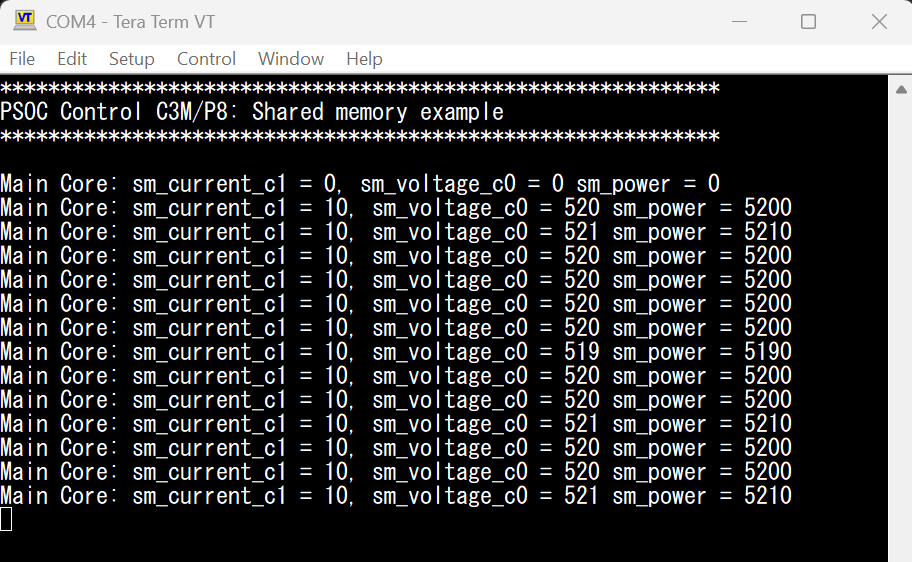

# PSOC&trade; Control C3M/P8: Shared memory example

This code example applies for PSOC&trade; Control C3M/P8 MCUs. It demonstrates the communication between cores via shared memory. PPCA core 0 captures a voltage value and PPCA core 1 captures a current value, both running at the same sampling frequency. The main core reads both values from shared memory, multiplies them to compute power, and prints all three values over UART.

Note: The following code example demonstrates the concept of shared memory using middleware to emulate a power calculation.

[View this README on GitHub.](https://github.com/Infineon/mtb-example-ce242383-shared-memory-usage)

[Provide feedback on this code example.](https://yourvoice.infineon.com/jfe/form/SV_1NTns53sK2yiljn?Q_EED=eyJVbmlxdWUgRG9jIElkIjoiQ0UyNDIzODMiLCJTcGVjIE51bWJlciI6IjAwMi00MjM4MyIsIkRvYyBUaXRsZSI6IlBTT0MmdHJhZGU7IENvbnRyb2wgQzNNL1A4OiBTaGFyZWQgbWVtb3J5IGV4YW1wbGUiLCJyaWQiOiJjaGlyYWdzYW1wYXQuamhhd2FyQGluZmluZW9uLmNvbSIsIkRvYyB2ZXJzaW9uIjoiMS4wLjAiLCJEb2MgTGFuZ3VhZ2UiOiJFbmdsaXNoIiwiRG9jIERpdmlzaW9uIjoiTUNEIiwiRG9jIEJVIjoiSUNXIiwiRG9jIEZhbWlseSI6IlBTT0MifQ==)

## Requirements

- [ModusToolbox&trade;](https://www.infineon.com/modustoolbox) v3.9.0 or later (tested with v3.9.0)
- Board support package (BSP) minimum required version for:
   - KIT_PSC3M8_EVK: v2.2.0
- Programming language: C
- Associated parts: All [PSOC&trade; Control C3M/P8 MCU](https://www.infineon.com/products/microcontroller/32-bit-psoc-arm-cortex/32-bit-psoc-control-arm-cortex-m33-mcu/psoc-control-c3-performance-line) parts


## Supported toolchains (make variable 'TOOLCHAIN')

- GNU Arm&reg; Embedded Compiler v14.2.1 (`GCC_ARM`) – Default value of `TOOLCHAIN`
- Arm&reg; Compiler v6.22 (`ARM`)
- IAR C/C++ Compiler v9.70.4 (`IAR`)


## Supported kits (make variable 'TARGET')

- [PSOC&trade; Control C3M8 Evaluation Kit](https://www.infineon.com/KIT_PSC3M8_EVK) (`KIT_PSC3M8_EVK`) – Default value of `TARGET`

## Hardware setup

This example uses the board's default configuration. See the kit user guide to ensure that the board is configured correctly.

## Software setup

See the [ModusToolbox&trade; tools package installation guide](https://www.infineon.com/ModusToolboxInstallguide) for information about installing and configuring the tools package.

Install a terminal emulator if you do not have one. Instructions in this document use [Tera Term](https://teratermproject.github.io/index-en.html).

This example requires no additional software or tools.


## Using the code example


### Create the project

The ModusToolbox&trade; tools package provides the Project Creator as both a GUI tool and a command line tool.

<details><summary><b>Use Project Creator GUI</b></summary>

1. Open the Project Creator GUI tool

   There are several ways to do this, including launching it from the dashboard or from inside the Eclipse IDE. For more details, see the [Project Creator user guide](https://www.infineon.com/ModusToolboxProjectCreator) (locally available at *{ModusToolbox&trade; install directory}/tools_{version}/project-creator/docs/project-creator.pdf*)

2. On the **Choose Board Support Package (BSP)** page, select a kit supported by this code example. See [Supported kits](#supported-kits-make-variable-target)

   > **Note:** To use this code example for a kit not listed here, you may need to update the source files. If the kit does not have the required resources, the application may not work

3. On the **Select Application** page:

   a. Select the **Application(s) Root Path** and the **Target IDE**

      > **Note:** Depending on how you open the Project Creator tool, these fields may be pre-selected for you

   b. Select this code example from the list by enabling its check box

      > **Note:** You can narrow the list of displayed examples by typing in the filter box

   c. (Optional) Change the suggested **New Application Name** and **New BSP Name**

   d. Click **Create** to complete the application creation process

</details>


<details><summary><b>Use Project Creator CLI</b></summary>

The 'project-creator-cli' tool can be used to create applications from a CLI terminal or from within batch files or shell scripts. This tool is available in the *{ModusToolbox&trade; install directory}/tools_{version}/project-creator/* directory.

Use a CLI terminal to invoke the 'project-creator-cli' tool. On Windows, use the command-line 'modus-shell' program provided in the ModusToolbox&trade; installation instead of a standard Windows command-line application. This shell provides access to all ModusToolbox&trade; tools. You can access it by typing "modus-shell" in the search box in the Windows menu. In Linux and macOS, you can use any terminal application.

The following example clones the "[mtb-example-ce242383-shared-memory-usage](https://github.com/Infineon/mtb-example-ce242383-shared-memory-usage)" application with the desired name "SharedMemory" configured for the *KIT_PSC3M8_EVK* BSP into the specified working directory, *C:/mtb_projects*:

   ```
   project-creator-cli --board-id KIT_PSC3M8_EVK --app-id mtb-example-ce242383-shared-memory-usage --user-app-name SharedMemory --target-dir "C:/mtb_projects"
   ```

The 'project-creator-cli' tool has the following arguments:

Argument | Description | Required/optional
---------|-------------|-----------
`--board-id` | Defined in the <id> field of the [BSP](https://github.com/Infineon?q=bsp-manifest&type=&language=&sort=) manifest | Required
`--app-id`   | Defined in the <id> field of the [CE](https://github.com/Infineon?q=ce-manifest&type=&language=&sort=) manifest | Required
`--target-dir`| Specify the directory in which the application is to be created if you prefer not to use the default current working directory | Optional
`--user-app-name`| Specify the name of the application if you prefer to have a name other than the example's default name | Optional

<br>

> **Note:** The project-creator-cli tool uses the `git clone` and `make getlibs` commands to fetch the repository and import the required libraries. For details, see the "Project creator tools" section of the [ModusToolbox&trade; tools package user guide](https://www.infineon.com/ModusToolboxUserGuide) (locally available at {ModusToolbox&trade; install directory}/docs_{version}/mtb_user_guide.pdf).

</details>


### Open the project

After the project has been created, you can open it in your preferred development environment.


<details><summary><b>Eclipse IDE</b></summary>

If you opened the Project Creator tool from the included Eclipse IDE, the project will open in Eclipse automatically.

For more details, see the [Eclipse IDE for ModusToolbox&trade; user guide](https://www.infineon.com/MTBEclipseIDEUserGuide) (locally available at *{ModusToolbox&trade; install directory}/docs_{version}/mt_ide_user_guide.pdf*).

</details>


<details><summary><b>Visual Studio (VS) Code</b></summary>

Launch VS Code manually, and then open the generated *{project-name}.code-workspace* file located in the project directory.

For more details, see the [Visual Studio Code for ModusToolbox&trade; user guide](https://www.infineon.com/MTBVSCodeUserGuide) (locally available at *{ModusToolbox&trade; install directory}/docs_{version}/mt_vscode_user_guide.pdf*).

</details>


<details><summary><b>Command line</b></summary>

If you prefer to use the CLI, open the appropriate terminal, and navigate to the project directory. On Windows, use the command-line 'modus-shell' program; on Linux and macOS, you can use any terminal application. From there, you can run various `make` commands.

For more details, see the [ModusToolbox&trade; tools package user guide](https://www.infineon.com/ModusToolboxUserGuide) (locally available at *{ModusToolbox&trade; install directory}/docs_{version}/mtb_user_guide.pdf*).

</details>


## Operation

1. Use the PSOC&trade; Control C3M8 Evaluation Kit (`KIT_PSC3M8_EVK`)

2. Connect the board to your PC using the provided USB cable through the KitProg3 USB connector

3. Open a terminal program and select the KitProg3 COM port. Set the serial port parameters to 8N1 and 115200 baud

4. Program the board using one of the following:

   <details><summary><b>Using Eclipse IDE for ModusToolbox&trade; software</b></summary>

      1. Select the application project in the Project Explorer

      2. In the **Quick Panel**, scroll down, and click **\<Application Name> Program**
   </details>


   <details><summary><b>Using CLI</b></summary>

     From the terminal, execute the `make program` command to build and program the application using the default toolchain to the default target. The default toolchain is specified in the application's Makefile but you can override this value manually:
      ```
      make program TOOLCHAIN=<toolchain>
      ```

      Example:
      ```
      make program TOOLCHAIN=GCC_ARM
      ```
   </details>

5. After programming, the application starts automatically. Confirm that "PSOC Control C3M/P8: Shared memory example" is displayed on the UART terminal

   **Figure 1. Terminal output on program startup**

   

6. Rotate the potentiometer R221(AIN0N) and R262(AIN10P) to change the voltage and current values and observe the power


## Debugging

You can debug the example to step through the code.


<details><summary><b>In Eclipse IDE</b></summary>

Use the **\<Application Name> Debug (KitProg3_MiniProg4)** configuration in the **Quick Panel**. For details, see the "Program and debug" section in the [Eclipse IDE for ModusToolbox&trade; user guide](https://www.infineon.com/MTBEclipseIDEUserGuide) (locally available at *{ModusToolbox&trade; install directory}/docs_{version}/mt_ide_user_guide.pdf*).

</details>


<details><summary><b>In other IDEs</b></summary>

Follow the instructions in your preferred IDE.

</details>


## Design and implementation

PPCA memory block M4 is the designated areas for inter-core communication. Instead of using fixed addresses for variables and taking care of the address translation manually for main and PPCA cores, the linkerscript is used to automated the allocation and address translation. 

The memory region marked `.icc_sharedmem` is reserved via linkerscript for all cores. In applications, variables declared using `__SM_ATTR__` will go to the region of `.icc_sharedmem`. 

All of main core and PPCA cores projects include `shared` folder, where the `sm_vars.h/.c` declares the shared variables. The variables declared will have the same relative addresses for all the cores with help of linkerscript, therefore you can eliminating the direct use of addresses. 


### Resources and settings


The application uses the UART to print messages on the UART terminal. The UART resource initialization and retargeting of standard I/O to the UART port is performed using the [retarget-io](https://github.com/Infineon/retarget-io) library.

**Table 1. Application resources**

 Resource  |  Alias/object     |    Purpose
 :-------- | :-------------    | :------------
 UART (HAL) | DEBUG_UART_hal_obj   | UART HAL object used by Retarget-IO for the Debug UART port

<br>


## Related resources

Resources  | Links
-----------|----------------------------------
Code examples  | [Using ModusToolbox&trade;](https://github.com/Infineon/Code-Examples-for-ModusToolbox-Software) on GitHub
Device documentation | [PSOC&trade; Control C3M/P8 MCU documents](https://www.infineon.com/products/microcontroller/32-bit-psoc-arm-cortex/32-bit-psoc-control-arm-cortex-m33-mcu/psoc-control-c3-performance-line?ftab=01#Documents)
Development kits | Select your kits from the [Evaluation board finder](https://www.infineon.com/cms/en/design-support/finder-selection-tools/product-finder/evaluation-board)
Libraries on GitHub  | [mtb-dsl-psc3m8](https://github.com/Infineon/mtb-dsl-psc3m8) – Device Support Library (DSL) <br> [retarget-io](https://github.com/Infineon/retarget-io) – Utility library to retarget STDIO messages to a UART port
Tools  | [ModusToolbox&trade;](https://www.infineon.com/modustoolbox) – ModusToolbox&trade; software is a collection of easy-to-use libraries and tools enabling rapid development with Infineon MCUs for applications ranging from wireless and cloud-connected systems, edge AI/ML, embedded sense and control, to wired USB connectivity using PSOC&trade; Industrial/IoT MCUs, AIROC&trade; Wi-Fi and Bluetooth&reg; connectivity devices, XMC&trade; Industrial MCUs, and EZ-USB&trade;/EZ-PD&trade; wired connectivity controllers. ModusToolbox&trade; incorporates a comprehensive set of BSPs, HAL, libraries, configuration tools, and provides support for industry-standard IDEs to fast-track your embedded application development

<br>


## Other resources

Infineon provides a wealth of data at [www.infineon.com](https://www.infineon.com) to help you select the right device, and quickly and effectively integrate it into your design.


## Document history

Document title: *CE242383* – *PSOC&trade; Control C3M/P8: Shared memory example*

 Version | Description of change
 ------- | ---------------------
 1.0.0   | New code example
<br>


All referenced product or service names and trademarks are the property of their respective owners.

The Bluetooth&reg; word mark and logos are registered trademarks owned by Bluetooth SIG, Inc., and any use of such marks by Infineon is under license.

PSOC&trade;, formerly known as PSoC&trade;, is a trademark of Infineon Technologies. Any references to PSoC&trade; in this document or others shall be deemed to refer to PSOC&trade;.

---------------------------------------------------------

(c) 2024-2026, Infineon Technologies AG, or an affiliate of Infineon Technologies AG. All rights reserved.
This software, associated documentation and materials ("Software") is owned by Infineon Technologies AG or one of its affiliates ("Infineon") and is protected by and subject to worldwide patent protection, worldwide copyright laws, and international treaty provisions. Therefore, you may use this Software only as provided in the license agreement accompanying the software package from which you obtained this Software. If no license agreement applies, then any use, reproduction, modification, translation, or compilation of this Software is prohibited without the express written permission of Infineon.
<br>
Disclaimer: UNLESS OTHERWISE EXPRESSLY AGREED WITH INFINEON, THIS SOFTWARE IS PROVIDED AS-IS, WITH NO WARRANTY OF ANY KIND, EXPRESS OR IMPLIED, INCLUDING, BUT NOT LIMITED TO, ALL WARRANTIES OF NON-INFRINGEMENT OF THIRD-PARTY RIGHTS AND IMPLIED WARRANTIES SUCH AS WARRANTIES OF FITNESS FOR A SPECIFIC USE/PURPOSE OR MERCHANTABILITY. Infineon reserves the right to make changes to the Software without notice. You are responsible for properly designing, programming, and testing the functionality and safety of your intended application of the Software, as well as complying with any legal requirements related to its use. Infineon does not guarantee that the Software will be free from intrusion, data theft or loss, or other breaches (“Security Breaches”), and Infineon shall have no liability arising out of any Security Breaches. Unless otherwise explicitly approved by Infineon, the Software may not be used in any application where a failure of the Product or any consequences of the use thereof can reasonably be expected to result in personal injury.